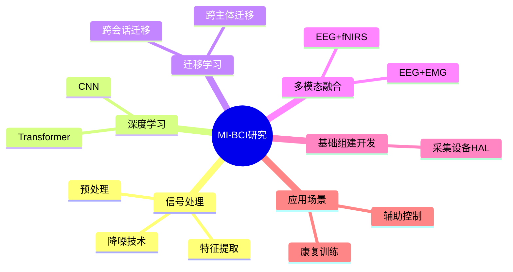

<!-- 个性化标题横幅 -->

  

  
  
  &nbsp;&nbsp;
  

 

## 
👋 关于我

  
我是一名软件开发者，目前主要从事脑机接口技术研究，特别是运动想象脑电图（MI-EEG）方向。

  
- 💻 主要从事软件开发工作
- 📚 专注于脑机接口技术研究
- 🤝 欢迎技术交流与合作

 

## 
🛠️ 技术栈

💻 编程语言

 

🔧 开发工具

 

💪 专业技能

 

🖥️ 操作系统

 

 

## 
🧠 研究方向：MI-BCI

```mermaid
mindmap
  root((MI-BCI研究))
    信号处理
      预处理
      特征提取
      降噪技术
    深度学习
      CNN
      Transformer
    迁移学习
      跨主体迁移
      跨会话迁移
    多模态融合
      EEG+EMG
      EEG+fNIRS
    基础组建开发
        采集设备HAL
    应用场景
      康复训练
      辅助控制
```

 

## 
📊 GitHub 统计

  

 

## 
📫 联系我

如果您对我的研究感兴趣，或者想要交流技术，欢迎通过以下方式联系我：

 

